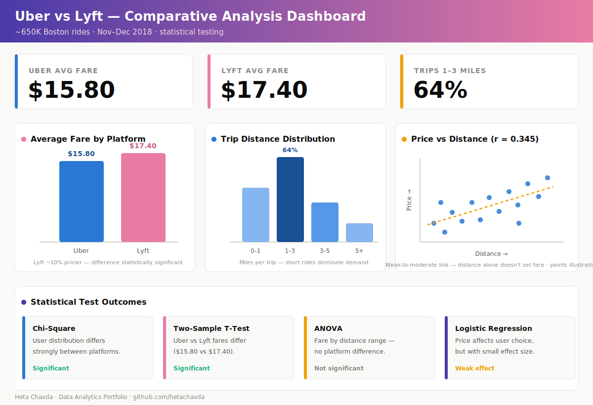

<div align="center">



# 🚗 Uber vs Lyft — A Data-Driven Showdown
### Comparative Statistical Analysis of Ride-Sharing Pricing & Demand — Python


</div>

---

## 📌 Project at a Glance

| | |
|---|---|
| **🎯 Goal** | Compare Uber vs Lyft on pricing, demand, and user switching behavior |
| **🧠 Approach** | Statistical hypothesis testing (Chi-Square, T-Test, ANOVA, Logistic Regression) |
| **📊 Data** | ~650,000 Boston ride records, Nov–Dec 2018 |
| **📈 Delivery** | Final report, presentation, and proposal with data-driven recommendations |

---

## 🧩 Business Problem

Two rivals, one market — and riders who switch on price. Which platform wins on cost, and does price actually decide who people ride with?

> 🚗 **The question:** *Do Uber and Lyft differ meaningfully on fares, and does price drive user choice between them?*

Answering this tells each platform where to **compete on price**, where to **differentiate on value**, and how to **defend market share** in a crowded ride-share market.

---

## 🗂️ Dataset

| Attribute | Detail |
|---|---|
| 🚕 **Records** | ~650,000 rides |
| 🗺️ **Location** | Boston, MA |
| 🗓️ **Period** | November – December 2018 |
| 🧾 **Key fields** | cab_type, price (USD), distance (miles), timestamp, surge_multiplier, source / destination, ride_type |

---

## 🔬 Methodology

```
DATA PREP                    STATISTICAL TESTS               INTERPRETATION
──────────────────           ──────────────────────────      ────────────────────
1. Load ~650K rides          1. Chi-Square → user split      1. Effect size review
2. Clean & type-cast         2. Two-Sample T-Test → fares    2. Significance (p-values)
3. Feature checks            3. ANOVA → fare vs distance     3. Business framing
4. EDA (price/distance)      4. Logistic Reg → price→choice  4. Platform recommendations
```

---

## 📊 Ride-Sharing Comparison Dashboard

<div align="center">



*Fare comparison, trip-distance distribution, and price-to-fare relationship, built from the project's Python statistical analysis.*

</div>

---

## 📈 Key Insights

- **Lyft costs more:** average fare of **$17.40 vs Uber's $15.80** — a difference that tested as statistically significant.
- **Short trips rule:** **1–3 mile rides make up 64%** of all trips — the core of the market.
- **Distance ≠ fare (mostly):** distance-to-fare correlation was only **0.345** (weak-to-moderate), and ANOVA found fare differences **by distance were not significant** between platforms.
- **Different crowds:** the Chi-Square test found **strong evidence of different user distributions** across the two platforms.
- **Price nudges, not decides:** logistic regression showed price **does influence user choice, but with a small effect size** — riders weigh more than cost alone.

---

## 💼 Business Impact

| Platform | Recommendation |
|---|---|
| 🟣 **Lyft** | Justify the premium with better features; offer targeted discounts on short (1–3 mi) trips |
| ⬛ **Uber** | Lean into affordability messaging and launch loyalty programs to lock in riders |
| 🤝 **Both** | Differentiate beyond price — quality, availability, and smarter surge-pricing |

---

## 🛠️ Technologies Used

| Category | Tools |
|---|---|
| **Language** | Python |
| **Data** | Pandas, NumPy |
| **Statistics** | Chi-Square, T-Test, ANOVA, Logistic Regression |
| **Visualization** | Matplotlib, Seaborn |

---

## 📁 Repository Contents

```
Uber vs Lyft Comparative Analysis/
├── 📁 assets/
│   ├── 🎨 banner.svg            # Repository banner
│   └── 📊 dashboard.svg         # Comparative dashboard
├── 📁 docs/
│   ├── 📄 FInal Presentation.pptx   # Slides
│   ├── 📄 Final Report.docx     # Full write-up
│   └── 📄 Project Proposal.pdf  # Project proposal
└── 📝 README.md                 # Project overview
```

---

<div align="center">

**Heta Chavda** — Data Analytics | Machine Learning | Business Intelligence

[](https://github.com/hetachavda)
[](https://linkedin.com/in/hetachavda)

⭐ *Found this useful? Give it a star!*

</div>
